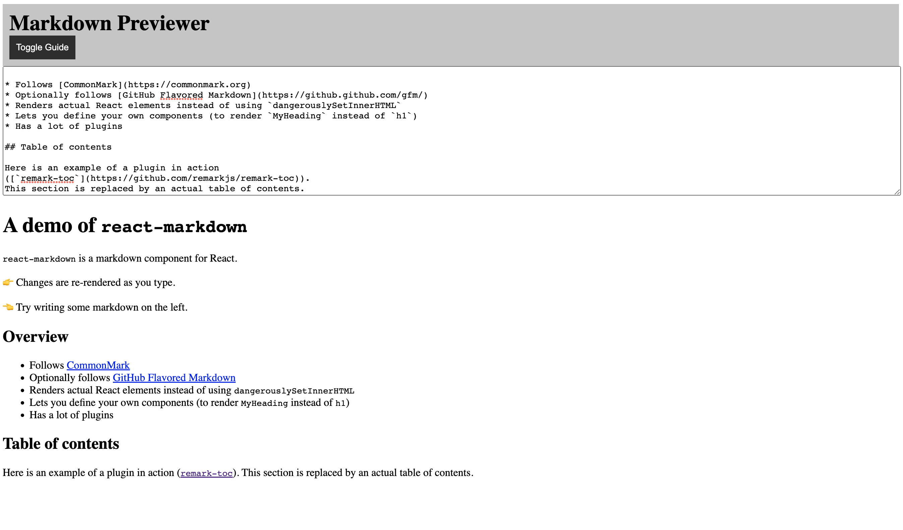

# Markdown Previewer

## Overview

This is a Markdown Previewer built with React and TypeScript. It allows the user to input Markdown text and instantly displays the corresponding HTML output. The project also supports GitHub-flavored Markdown and syntax highlighting.

 <!-- Replace with actual screenshot -->

## Features

- Real-time Markdown to HTML conversion
- Support for GitHub-flavored Markdown
- Code syntax highlighting
- Stylish, responsive design

## Technologies Used

- React
- TypeScript
- styled-components
- remark-gfm

## Installation

1. Clone the repository

   ```bash
   git clone https://github.com/KeenoLee/react-markdown-previewer.git

   ```

2. Navigate to the project folder

   ```bash
   cd markdown-previewer

   ```

3. Install dependencies

   ```bash
   npm install

   ```

4. Start the development server
   ```bash
   npm start dev
   ```

Usage
Open your browser and go to http://localhost:3000/. You should see the Markdown Previewer in action. Start typing Markdown text in the input area and see the HTML output on the fly.
